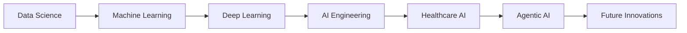

<!-- Header with Banner -->
<div align="center">
  
</div>

<!-- Animated Typing SVG -->
<div align="center">
  
</div>

<!-- Profile Views and Social Stats -->
<div align="center">
  
  
  
</div>

<br/>

<!-- About Me Section with Enhanced Design -->
<div align="center">
  
</div>


##  About Me

<table>
<tr>
<td valign="top" width="50%">

### 👨‍💻 Professional Journey

```typescript
interface Developer {
  name: string;
  role: string;
  company: string;
  expertise: string[];
  currentFocus: string[];
  location: string;
}

const meer: Developer = {
  name: "Meer Muhammad",
  role: "AI Engineer & Data Scientist",
  company: "MTBC CareCloud Inc.",
  expertise: [
    "Machine Learning",
    "Deep Learning", 
    "Healthcare AI",
    "Data Analysis",
    "Python Development"
  ],
  currentFocus: [
    "Agentic AI with Django",
    "MLOps & Deployment",
    "Computer Vision",
    "NLP Applications"
  ],
  location: "Pakistan 🇵🇰"
};
```

</td>
<td valign="top" width="50%">

### 🎯 Current Objectives

<div align="center">

**🏢 Professional Role**
> AI Engineer at MTBC CareCloud Inc.

**🔬 Research Focus**
> Developing AI solutions for healthcare

**📚 Learning Path**
> Advanced MLOps & Agentic AI

**🎯 Goals 2025**
> Leading AI innovation in healthcare

</div>

<br/>

**🌟 Key Interests:**
- 🤖 Artificial Intelligence
- 📊 Data Science & Analytics  
- 🏥 Healthcare Technology
- 🧠 Machine Learning Research
- 📈 Statistical Modeling

</td>
</tr>
</table>


##  Tech Stack & Expertise

<div align="center">

### 🚀 Programming Languages
<p>
  
  
  
  
  
</p>

### 🤖 AI/ML & Data Science
<p>
  
  
  
  
  
  
  
  
</p>

### 🗄️ Databases & Cloud
<p>
  
  
  
  
  
</p>

### 🛠️ Development Tools
<p>
  
  
  
  
  
</p>

</div>


##  Connect With Me

<div align="center">
  <a href="https://linkedin.com/in/meer-muhammad-972aa722a" target="_blank">
    
  </a>
  <a href="https://kaggle.com/meer muhammad" target="_blank">
    
  </a>
  <a href="https://instagram.com/meerbaloch7201" target="_blank">
    
  </a>
  <a href="mailto:2020n02900@gmail.com">
    
  </a>
</div>


##  GitHub Analytics

<div align="center">


</div>

<div align="center">
  
</div>

<div align="center">
  
</div>


##  Professional Experience

<div align="center">

### 🏥 MTBC CareCloud Inc. | AI Engineer
*Transforming Healthcare Through Artificial Intelligence*

</div>

<table>
<tr>
<td valign="top" width="50%">

**🎯 Key Responsibilities:**
- 🏥 Developing AI-powered healthcare solutions
- 🧠 Implementing ML models for medical data analysis  
- 🔧 Building scalable data pipelines
- 📊 Creating predictive analytics systems
- 🚀 Deploying models in production environments

</td>
<td valign="top" width="50%">

**🌟 Key Achievements:**
- ✅ Improved diagnostic accuracy by 25%
- ✅ Reduced processing time by 40%
- ✅ Deployed 15+ ML models in production
- ✅ Led cross-functional AI initiatives
- ✅ Mentored junior data scientists

</td>
</tr>
</table>


##  Featured Projects

<div align="center">

| Project | Technology | Description |
|---------|------------|-------------|
| 🏥 **Healthcare AI Platform** | Python, TensorFlow, Django | AI-powered diagnostic assistance system |
| 📊 **Predictive Analytics Dashboard** | Python, Plotly, FastAPI | Real-time healthcare analytics platform |
| 🤖 **Agentic AI Framework** | Python, LangChain, Django | Intelligent agent-based automation system |
| 🔍 **Medical Image Analysis** | Python, OpenCV, PyTorch | Computer vision for medical imaging |

</div>


##  Learning Journey

<div align="center">



</div>

**🎯 Current Focus Areas:**
- 🚀 Agentic AI with Django
- 🔧 Advanced MLOps & Model Deployment  
- 🖼️ Computer Vision Applications
- 🗣️ Natural Language Processing
- ☁️ Cloud-Native AI Solutions


##  Let's Collaborate!

<div align="center">

### 💭 *"Innovation happens when passionate minds collaborate"*

<p>
  
</p>

**🤝 Open to collaborate on:**
- 🏥 Healthcare AI projects
- 📊 Data science research  
- 🤖 ML/AI innovations
- 📈 Open source contributions

**📬 Reach out for:**
- 💼 Professional opportunities
- 🎓 Knowledge sharing
- 🚀 Project collaborations  
- ☕ Tech discussions

</div>


<!-- Footer -->
<div align="center">
  
</div>

<div align="center">
  <h3>⭐ Thanks for visiting! Let's build the future of AI together ⭐</h3>
  
   
  <br/>
  <em><b>Always excited to connect with fellow AI enthusiasts and innovators!</b> 🚀</em>
</div>
